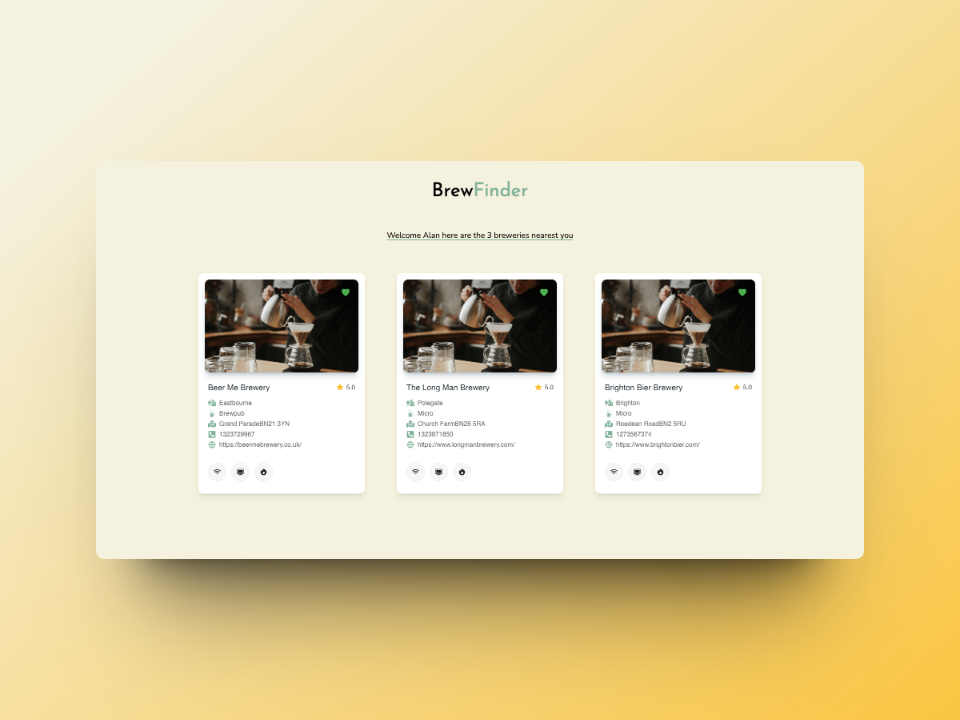

# BrewFinder

The BrewFinder is a mobile application designed to help users discover the nearest breweries based on their current location. Whether you're a craft beer enthusiast or just looking for a new place to socialize, this app provides an easy way to find breweries nearby.

## Features:
- **Location Detection:** Utilizes GPS functionality to pinpoint the user's current location.
- **Nearest Breweries:** Displays a list of breweries closest to the user's location, sorted by distance.
- **Detailed Brewery Information:** Provides detailed information about each brewery, including address, contact details, and opening hours.

## How to Use:
1. **Enable Location Services:** Ensure that location services are enabled on your device.
2. **Open the App:** Launch the BrewFinder app on your mobile device.
3. **Allow Location Access:** Grant the app permission to access your device's location.
4. **View Nearby Breweries:** Browse the list of breweries nearest to your location or explore the map view.
5. **Get Brewery Details:** Tap on a brewery to view detailed information, including address and contact details.

## Contribution:
Contributions to the Brewery Finder app are welcome! If you'd like to contribute new features, report bugs, or suggest improvements, please submit an issue or pull request on our GitHub repository.

